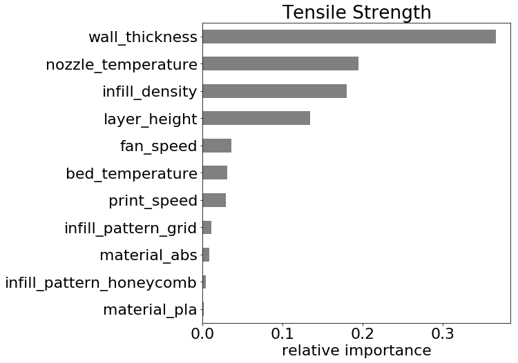
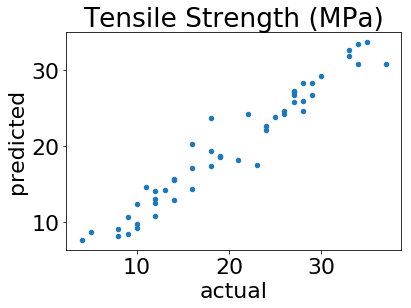
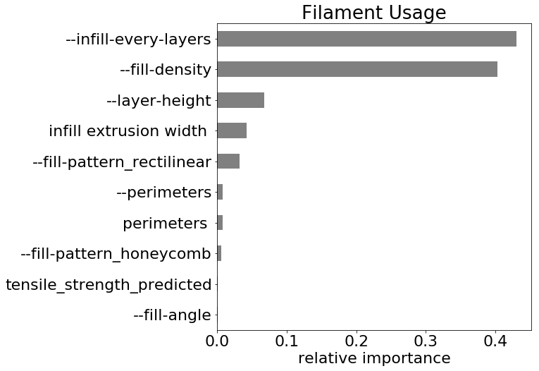
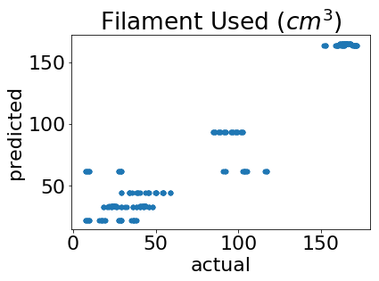
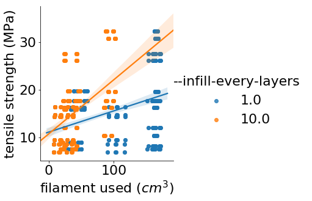
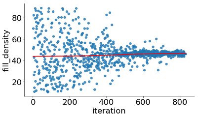

```{r setup, include=FALSE, echo=FALSE, message=FALSE}
knitr::opts_chunk$set(echo = FALSE)
library('knitr')
library('tidyverse')
```

# Introduction

In traditional manufacturing, complexity is expensive. The cost of complexity takes the form of work-in-progress, tooling, and time to prototype. These costs can be hard to estimate because they depend on many factors.[@gorguluarslan2017improved] In contrast, in three dimentional printing, complexity is free. There is a clear trade off between the strength of an object and the amount of material used to print the object. In this project, we aim to show a  method for simultaneously optimizing a 3D printable object for both strength and cost. three-dimensional printing is ready to become a viable alternative to conventional manufacturing. [@chen2016revolution]

Blender is an open-sourced design tool that can output .STL files. STL files specify the surface of a three-dimensional object in terms of triangles on the surface of the object. A consequence of triangular faces is that they require significantly less computational time because neither projection of the polyhedron faces onto the appropriate coordinate planes nor reduction using Green’s Theorem are necessary. [@eberly2002polyhedral]

Slic3r is an open-sourced tool to convert a model into printing instructions. It creates horizontal slices (layers) and generates tool-paths needed to fill them. It can also calculate the amount of filament to be extruded.

The goal of this project is to create an end-to-end flow from STL file to optimal G-Code file. In order to do that we have to design an experiment, slicing the STL file in many different ways. Focusing the infill parameters, we collect the metadata from the g-code output and enrich with some previously collected tensile strength data. Then we can model both the strength of the object and the amount of filament used to print the object. With those models in hand, we define a cost function that is proportional to filament used minus strength. Using a differential evolution algorithm to find the minimum cost.

@tang2017lattice propoesd a lattice design.

Lattice structures can improve stiffness. [@tang2017lattice]

Von-Mises stress and displacement can be reduced without increasing the volume.[@tang2017lattice]

manufacturability can be ensured by use of experimentation and artificial neural networks.[@tang2017lattice]


The lower bound of cross-sectional should be the smallest value that can possible. [gorguluarslan2017improved]


> "additive manufacturing is one of the most promising technologies in the field of manufacturing." - @majeed2018framework

@majeed2018framework has demonstrated the use of big data optimization for additive manufacturing.


the convergence of the genetic algorithm could be further improved.[@gorguluarslan2017improved]

For example, a heuristic search could be implemented in order to generate better initial populations, or a quick local search could be done after each crossover and mutation, in order to obtain better child chromosomes.[@gorguluarslan2017improved]


In the first phase, the lattice structure is generated using the mesh information of the structure geometry.[@gorguluarslan2017improved]


If the manufacturing constraint is directly used in the ground structure optimization process, the unnecessary elements cannot be removed from the structure and therefore the performance is worse than the obtained one when the proposed method is used, as shown in @gorguluarslan2017improved.[@gorguluarslan2017improved]

It is also shown that the optimized structure has better performance compared to alternative existing methods.[@gorguluarslan2017improved]

The second example is used to investigate the minimum diameter value that can be fabricated using the SLS process that will be used for the fabrication of the optimized lattice-based pillar structure.[@gorguluarslan2017improved]


The third example was a real-world application of the lattice structure optimization for a seat-bottom frame with a larger number of design variables when compared to the previous examples.[@gorguluarslan2017improved]


Moreover, it is shown in the second and third examples that the two-phase optimization framework can successfully find an optimized structure that can be fabricated once the minimum value is known for the specific additive manufacturing machine. [@gorguluarslan2017improved]

Molecular dynamics model, discrete element, and finite element model were developed to understand sintering, powder flow, residual stress and cracking in the components.[@zhang2018multi]

The diffusion of atoms is higher on particle surface than the particle core.[@zhang2018multi]

tensile test simulations of sintered material show that sintered nickel particles have lower mechanical strengths than the bulk nickel. [@zhang2018multi]

Higher heating rate leads to a higher mechanical strength because of accelerated sintering rates. [@zhang2018multi]
 
The effect of laser power on the temperature distribution of the powder bed was studied using the DEM. [@zhang2018multi]

The average temperature in the powder bed increases with higher laser power. [@zhang2018multi]
 
@garechana2019method describes our approach for the detection of core technological solutions—which we call "technology fronts" underlying certain device or broad development (three-dimensional printing has been the choice, as explained in the introduction) and the characterization of their dynamics of change across time.[@garechana2019method]


These terms were crossed with patents to build term-document matrices corresponding to a set of time intervals that span from year 1985 to 2017.[@garechana2019method]


We found that some of these fronts are in part coincident with the main taxonomies of typical devices in the three-dimensional printing industry, while others describe "hot points" where engineering efforts are put into practice to improve critical aspect of the devices.[@garechana2019method]


Fortunately, with the wide use of smart sensing devices, real-time and multi-source data can now be collected. [@majeed2018framework]

In @majeed2018framework, a framework for big data-driven manufacturing process optimization for additive manufacturing has been proposed. [@majeed2018framework]

The second contribution is the big data acquisition and integration method was developed.  [@majeed2018framework]

It can be used to collect the multi-source data for additive manufacturing, and then process and exchange the big data between heterogeneous enterprise information systems.  [@majeed2018framework]

The third contribution is the big data mining and optimization of additive manufacturing.  [@majeed2018framework]

The data mining method can be used to reveal the relationship between the production performance and process parameters, and the process parameters can be optimized to improve the production performance. [@majeed2018framework]

The real-time data can be acquired and transmitted to the enterprise database. [@majeed2018framework]

With the help of big data and analysis of variance (ANOVA), the process parameters of additive manufacturing have been optimized to minimize the energy consumption, improve the product quality, and improve the production efficiency by minimizing process time. [@majeed2018framework]


Future research works will be carried out on the application of @majeed2018framework's framework and development of the algorithm to optimize the parameters of the additive manufacturing for different materials and processes. [@majeed2018framework]


# Workflow

In @gorguluarslan2017improved, we present Falcon, a new system that follows a visual analytics approach to improve knowledge discovery in long and complex time series data with practical applications to the field of additive manufacturing.[@gorguluarslan2017improved]
The calculated activation energy of nickel particle diffusion is 6.10 kJ/mole in the particle core, and 6.24 kJ/mole on the particle surface, which are reasonably in agreement with experimental data 7.89 kJ/mole. [@zhang2018multi]

In order to study the behavior of these technology fronts, and considering the data features of transversal developments, we opted for a subsetting strategy based on the gamma values returned by the topic modeling solution for each patent, so we could build sub-data sets containing the patents in which claims were clearly focused on the topics identified by our approach.[@garechana2019method]
During additive manufacturing processes, a huge amount of real-time big data is generated. [@majeed2018framework]

Falcon provides linked visualizations from both temporal and statistical orientations with automated analytics to highlight interesting features. 
From our informal evaluations of the applied use of Falcon in additive manufacturing, we have learned that non-visualization experts can be vital members of interdisciplinary design teams as they help design new capabilities that respond to their actual needs, and they quickly employ new visual analytics techniques in creative ways to solve problems.[@gorguluarslan2017improved]
The parallels between the analytical goals in additive manufacturing and other domains suggest that these capabilities are broadly applicable to many domains as they help users develop and refine a more complete mental model of complicated and large-scale time series data. [@steed2017falcon]
These matrices were analyzed using a topic modeling technique, which has shed light on the technology fronts being developed under the broad field of three-dimensional printing.[@garechana2019method]
Metrics built on patent data were used to characterize the rate of change of technology fronts, analyzing each of these on a relative basis with respect to the values produced by the rest of the fronts. [@garechana2019method]
@majeed2018framework provides a good basis for the application of big data analytics in the additive manufacturing process. [@majeed2018framework]
@majeed2018framework brings three contributions to successfully implement the big data analytics in the area of additive manufacturing.  [@majeed2018framework]
The first contribution is the architecture of big data-based analytics and its key components in additive manufacturing.  [@majeed2018framework]

# Simulation and Modeling
First we model tensile strength. 
After applying that model to the metadata, we model filament usage as a function of similar inputs.

when we modeled strength, we found that the most important parameter was wall thickness. Extrusion temperature, and fill density were also significantly predictive of tensile strength. Every other parameter we looked at was discarded, the top ten features are summarized here.

we used a random Forest to predict tensile strength from these four parameters.

Predictors of tensile strength
```{r echo=FALSE}
data.frame(column = c('wall thickness',
                      'nozzle temperature',
                      'infill density',
                      'layer height',
                      'fan speed',
                      'bed temperature',
                      'print speed',
                      'infill pattern',
                      'material'
                      )
           ,description = c('Number of solid layers on surface',
                            'Extrusion temperature',
                            'percent of volume to fill with pattern',
                            'height of each layer',
                            'speed of cooling fan',
                            'temperature of platform',
                            'speed of robot arm',
                            'pattern of non-solid layers',
                            'material'
                            )
           ,units = c('# of layers',
                      '°C',
                      '%',
                      'mm',
                      '% of max',
                      '°C',
                      'mm/s',
                      'Rectilinear or Honeycomb',
                      'ABS or PLA'
                      )
           ) %>% kable()
```

```{r}

```

```{r}

```


Predictors of Filament usage
```{r echo=FALSE}
data.frame(column = c('infill every layers',
                      'fill density',
                      'layer height',
                      'infill extrusion width',
                      'fill pattern',
                      'perimeters',
                      'fill angle'
                      )
           ,description = c(' Infill every N layers ',
                      'volume to fill with pattern',
                      'height of each layer',
                      'filament flow width',
                      'fill pattern',
                      'horizontal solid layers',
                      'horizontal infill pattern'
                            )
           ,units = c('#',
                      '%',
                      'mm',
                      'mm',
                      'fill pattern',
                      'perimeters',
                      'degrees'
                      )
           ) %>% kable()
```

```{r}

```

```{r}

```

For filming usage, we found that the number of skipped layers, in-fill density and layer height are significantly important. Every other future was discarded. We used a 2nd random Forest to predict filament usage from these three parameters.

Improving the accuracy these models is beyond the scope of this project. 

Looking at a plot of strength vs filament usage we see an opportunity for optimization in the top left corner where using less filament results in reasonably strong object.


@chen2016revolution found thickness of Fill, Fill Rate, Extruder Speed and Extruder Head Temperature have an effect on tensile strength.[@chen2016revolution]

# Model Limitations
The limitation of @majeed2018framework is that only a framework is proposed, and the algorithm for data analysis, such as association, classification and clustering are not studied in @majeed2018framework. [@majeed2018framework]

To do so, an initial manufacturable lattice structure is generated under the overhanging areas. [@gorguluarslan2017improved]


```{r}
data.frame(failure = c('overhang',
                       'shinkage',
                       'pillowing',
                       'stringing'
                       )
           ,effect = c('collapse',
                       'deformation at corners',
                       'sagging infill',
                       'unintended structure'
                       )
           ,coutermeasure = c('add support structures',
                              'increase fan speed',
                              'increase fill density',
                              'decrease retraction speed'
                              )
           ) %>% kable()
```

over-hanging areas with no common support structures (two disjoint subgraphs) could be separated in various clusters, and each cluster could be optimized again with a normal optimization.[@gorguluarslan2017improved]

While support structures are outside the scope of this project, @gorguluarslan2017improved provides a framework to optimize support structures for additive manufacturing.


# Optimization

In order to find a minimum cost we can ask a genetic algorithm to modulate these five parameters and search the space. Here we've shown how fill density collapses towards an Optimum just under 50% fill density. 

looking at a default slicing rectilinear infill pattern and a single wall infill density about 13% I compared it to our Optimum slicing infill about 50% pattern is Honeycomb and four layers but they use about the same amount of material. in order to generate better initial populations. [@gorguluarslan2017improved]

The analysis of the results concludes that the process capability indices (Cp and Cpk), can be improved and at the same time optimal parameters can be identified using Six Sigma DMAIC (Define, Measure, Analyze, Improve, and Control) approach which is a win-win situation.[@chen2016revolution] 

A BESO(Bidirectional Evolutionary Structural Optimization)-based optimization process is used to find the optimum struts’ thickness distribution.[@tang2017lattice]

The heterogeneous lattice structure optimized by the proposed method has a better performance compared to the homogenous lattice structure.[@tang2017lattice]
Finally, the process can be optimized to obtain a larger feasible area for design and optimization. [@tang2017lattice]

relations between strut dimensions and mechanical properties can provide a feedback to lattice simulation and optimization model with more accurate material properties.[@tang2017lattice]


In order to further improve the optimization of the support structures, the objective function (that only includes the material volume) could be extended, by taking into account the support removal and finishing costs.[@gorguluarslan2017improved]

The first example, i.e. the cantilever beam example, is used to show that the proposed framework can produce an optimized structure with minimal computational cost by considering the minimum manufacturing limit.[@gorguluarslan2017improved]

@gorguluarslan2017improved has shown that using a genetic algorithm performs better traditional generation strategies.
```{r}

```


```{r}

```


```{r}
include_graphics('../images/nonoptimalslice.png')
```


```{r}
include_graphics('../images/optimalgcode.png')
```

# Summary

\newpage

# References
