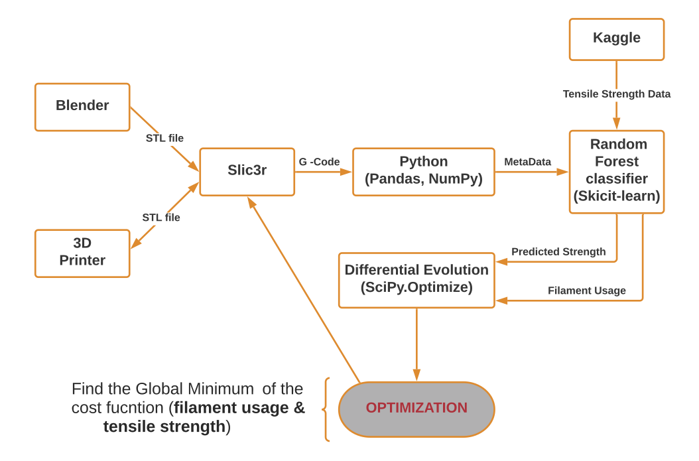

```{r setup, include=FALSE, echo=FALSE, message=FALSE}
knitr::opts_chunk$set(echo = FALSE)
library('knitr')
library('tidyverse')
```

# Introduction

In traditional manufacturing, complexity is expensive. The cost of complexity takes the form of work-in-progress, tooling, and time to prototype. These costs can be hard to estimate because they depend on many factors. [@gorguluarslan2017improved] In contrast, in three dimensional printing, complexity is free. There is a clear trade off between the strength of an object and the amount of material used to print the object. In this project, we aim to show a  method for simultaneously optimizing a 3D printable object for both strength and cost. Three-dimensional printing is ready to become a viable alternative to conventional manufacturing. [@chen2016revolution]

The goal of this project is to create an end-to-end flow from STL file to optimal G-Code file. In order to achieve this goal, we have to design an experiment, slicing the STL file in many different ways. We chose to focusing on the infill parameters. we collect the metadata from the g-code output and enrich with some previously collected tensile strength data. Then we can model both the strength of the object and the amount of filament used to print the object. With those models in hand, we define a cost function that is proportional to filament used minus strength. Using a differential evolution algorithm to find the minimum cost. @majeed2018framework provides a good basis for the application of big data analytics in the additive manufacturing process.

Blender is an open-sourced design tool that can output .STL files. STL files specify the surface of a three-dimensional object in terms of triangles on the surface of the object. In the first phase, the lattice structure is generated using the mesh information of the structure geometry. [@gorguluarslan2017improved] A consequence of triangular faces is that they require significantly less computational time because neither projection of the polyhedron faces onto the appropriate coordinate planes nor reduction using Green’s Theorem are necessary. [@eberly2002polyhedral]

Slic3r is an open-sourced tool written in perl which can convert an stl model into printing instructions. Gcode format refers to the fact that many robot movements needed for three dimensional printing start with the character 'G'. Slc3r creates horizontal slices (layers) and generates tool-paths needed to fill them. It can also calculate the amount of filament to be extruded.

The result of our optimization shows an optimal layer height at 6, fill density at 46%, fill-every-layers at 5, wall thickness at 5, and nozzle temperature at 277 degrees.
The optimal slicing uses 111.5cm3 of filament with a tensile strength 27 MPa compared to 67.2cm3 and 10 MPa for the default slicing parameters.

# Workflow

We point our code at a single stl file. Slic3r provides 144 command line parameters, we loop through every combination of high and low settings for about 9 command-line parameters.  this results in 2 to the 9th power combinations; a full factorial experiment. For each configuration we loop through the non-empty options and construct a command line string. Once the command string is constructed, we run slic3r and check for successful G-Code generation. We extract metadata from the resulting G-Code file. This metadata output includes the target parameter filament used in both volume ($cm^3$) and length in mm. During additive manufacturing, a huge amount of real-time big data is generated. [@majeed2018framework]

The process starts with an STL file. there are several software packages that are capable of modeling three-dimensional objects in STL format. We used Blender. our utility will slice a single STL file in many ways. After slicing, we use the metadata from the G-Code files and enrich with strength data which was experimentally determined. After optimization the optimal G-Code is constructed into a final command line string and executed by slic3r. Then we can open the G-Code file with software provided by any 3D printer manufacturer.

Our machine learning workflow starts by reading in strength data. We create an input matrix, X and an output vector, y. In this case y is tensile strength and X is every available feature except for strength, elongation, and roughness. which would not be available prior to testing strength. We avoid circular reasoning. The X matrix is further divided into numeric and non-numeric features. The non-numeric features are dummy encoded and joined back to the numeric features resulting in an X that is fully numeric and appropriate for machine learning. Upon training a random Forest, we extract the feature importance. Based on the future importance, we select a human determined cutoff for the most important features. We selected the top 4. Then iterate and retrain on just those features. Those 4 features are wall thickness, nozzle temperature, infill density and layer height. To validate the model we inspect the predicted vs. actual an accurate model will fall along the Y equals X line (45 degree line). Further inspecting the residual to ensure that it is normally distributed and centered on zero. We follow a similar process for filament usage. First we have to clean the filament used column by splitting apart the volume used and length used. The result is stripped of units and white space until we have an actual number appropriate for a model output vector. which is now our new y. the X in the case of filament used is all of the metadata except for duplicates of the slic3r parameters and any features which have exactly zero variance. Fitting a random Forest gives us feature portents, we cut off the most important features, 3 this time. retrain then inspect predicted vs. actual and residuals should be normally distributed. In this case of filament usage, there is some non normality at the tails but overall our model is appropriate. Analytical models help develop and refine a more complete mental model of complicated data. [@steed2017falcon]

Defining the cost function involves a lining up inputs of both models, 5 in total, ensuring consistent units and shape. During the cost function we can capture a callback o monitor progress of the optimization. we also have an opportunity to weight the simultaneous optimization. we started with 50/50 weighting. The input to the differential Evolution algorithm is the cost function we just defined along with the boundary condition for each input. we started with the minimum and maximum observed value in our original training data set. This is consistent with best practice.[@gorguluarslan2017improved] the result of our optimization shows that the optimal layer height is 6 fill density is the optimal infill layers is for the optimal wall thickness is 5 the optimal nozzle temperature is 277 degrees. Visualization is a vital component of design problem solving. [@gorguluarslan2017improved]


an example of the contents of a gcode file follows.

```gcode
; generated by Slic3r 1.2.9

; external perimeters extrusion width = 0.60mm
; perimeters extrusion width = 0.63mm
; infill extrusion width = 0.63mm
; solid infill extrusion width = 0.63mm
; top infill extrusion width = 0.63mm

M107
M104 S200 ; set temperature
G28 ; home all axes
G1 Z5 F5000 ; lift nozzle

M109 S200 ; wait for temperature to be reached
G21 ; set units to millimeters
G90 ; use absolute coordinates
M82 ; use absolute distances for extrusion
G92 E0
G1 Z0.350 F7800.000
G1 E-2.00000 F2400.00000
G92 E0
G1 X66.925 Y67.762 F7800.000
G1 E2.00000 F2400.00000
G1 X68.677 Y66.283 E2.07096 F1800.000
G1 X70.830 Y65.490 E2.14192
G1 X72.009 Y65.384 E2.17858
G1 X127.991 Y65.384 E3.91071
G1 X130.250 Y65.781 E3.98168
G1 X132.238 Y66.925 E4.05264 F1800.000
G1 X133.717 Y68.677 E4.12360
G1 X134.510 Y70.830 E4.19456
G1 X134.616 Y72.009 E4.23121
...
...
...
; filament used = 15777.7mm (111.5cm3)
; fill_angle = 45
; fill_density = 46.1292%
; fill_pattern = honeycomb
; gap_fill_speed = 20
; infill_every_layers = 4
; infill_extruder = 1
; infill_extrusion_width = 0
; infill_overlap = 15%
; infill_speed = 80
; overhangs = 1
; perimeter_extruder = 1
```


# Simulation and Modeling

(ref:workflowcaption) workflow diagram 

```{r workflow, echo=FALSE, fig.cap="(ref:workflowcaption)", out.width='100%', out.height='100%'}

```


Figure \ref{fig:workflow} shows our workflow.

In this project, we used FlashForge 3D printer to obtain a cube as a STL file and pass it through Slic3r to generate machine instructions in G-Code format. We then model tensile strength from data obtain from Kaggle: [@okudan20183dprinterdataset]. After applying that model to our metadata, we model filament usage as a function of similar inputs. 

When we modeled strength, we found that the most important parameter was wall thickness. Extrusion temperature, and fill density were also predictive of tensile strength. Every other parameter was discarded, the top ten features are summarized in \ref{:}.

We used a random forest to predict tensile strength from the four most important parameters (wall thickness, nozzle temperature, infill density, and layer height). We used a 2nd random forest to predict filament usage from the 3 most important parameters (infill every layers, fill density, and layer height)

Predictors of tensile strength
```{r kaggledata, echo=FALSE}
data.frame(column = c('wall thickness',
                      'nozzle temperature',
                      'infill density',
                      'layer height',
                      'fan speed',
                      'bed temperature',
                      'print speed',
                      'infill pattern',
                      'material'
                      )
           ,description = c('Number of solid layers on surface',
                            'Extrusion temperature',
                            'percent of volume to fill with pattern',
                            'height of each layer',
                            'speed of cooling fan',
                            'temperature of platform',
                            'speed of robot arm',
                            'pattern of non-solid layers',
                            'material'
                            )
           ,units = c('# of layers',
                      '°C',
                      '%',
                      'mm',
                      '% of max',
                      '°C',
                      'mm/s',
                      'Rectilinear or Honeycomb',
                      'ABS or PLA'
                      )
           ) %>% kable(caption = "top 10 predictors of tensile strength",booktabs=TRUE)
```

\newpage

```python
metadata=pd.Dataframe()
for configuration in product(*configurations.values())):
    metarow = pd.Series(configuration,index=configurations.keys())
    cmd=["slic3r"]
    for key,value in zip(configurations.keys(),configuration):
        metarow[key]=value
        if value:
            cmd.append(str(key))
            if not isinstance(value,bool):
                cmd.append(str(value))
    cmd.append(input_file)
    check_output(cmd)
    with open(gcode_file_path) as gcode_file:
        for line in gcode_file.readlines():
            if line.startswith(';'):
                datum = line.strip('; \n').split('=')
                if len(datum)==2:
                    metarow[datum[0]]=datum[1]
    metadata = metadata.append(metarow,ignore_index=True)
```

table \ref{tab:kaggledata} describes the features available to predict tensile strength.

```{r strengthfeatureimportance, echo=FALSE, fig.asp=1, fig.cap="\\label{fig:strengthfeatureimportance} relative importance for tensile strength", out.width='75%', out.height='75%'}
include_graphics('../images/strengthfeatureimportance.png', auto_pdf = TRUE)
```

root mean squared error of 2.05 MPa.

```{r, out.width='75%', out.height='75%' }

```
Figure \ref{fig:strengthfeatureimportance} shows our the relative importance of the top 10 feature for predicting tensile strength.

```{r tensilepredictedvsactual, echo=FALSE, fig.asp=1, fig.cap="\\label{fig:tensilepredictedvsactual} predicted tensile strength vs actual tensile strength", out.width='75%', out.height='75%'}
include_graphics('../images/tensilepredictedvsactual.png', auto_pdf = TRUE)
```

Figure \ref{fig:tensilepredictedvsactual} shows predicted tensile strength plotted against actual tensile strength


```{r metadata, echo=FALSE}
data.frame(column = c('infill every layers',
                      'fill density',
                      'layer height',
                      'infill extrusion width',
                      'fill pattern',
                      'perimeters',
                      'fill angle'
                      )
           ,description = c(' Infill every N layers ',
                      'volume to fill with pattern',
                      'height of each layer',
                      'filament flow width',
                      'fill pattern',
                      'horizontal solid layers',
                      'horizontal infill pattern'
                            )
           ,units = c('#',
                      '%',
                      'mm',
                      'mm',
                      'fill pattern',
                      'perimeters',
                      'degrees'
                      )
           ) %>% kable(caption = "Predictors of Filament usage", booktabs=TRUE)
```

\ref{metadata} describes the features available to predict filament usage.

```{r filamentfeatureimportance, echo=FALSE, fig.asp=1, fig.cap="\\label{fig:filamentfeatureimportance} relative importance for predicting filament usage", out.width='75%', out.height='75%'}
include_graphics('../images/filamentfeatureimportance.png', auto_pdf = TRUE)
```

Figure \ref{fig:filamentfeatureimportance} shows our the relative importance of the top 10 feature for predicting filament usage.

```{r filamentpredictedvsactual, echo=FALSE, fig.asp=1, fig.cap="\\label{fig:filamentpredictedvsactual} predicted filament used vs actual filament used", out.width='75%', out.height='75%'}
include_graphics('../images/filamentpredictedvsactual.png' , auto_pdf = TRUE)
```

Figure \ref{fig:filamentpredictedvsactual} shows predicted tensile strength plotted against actual tensile strength

root mean squared error of $17.2 cm^3$

```{r, out.width='75%', out.height='75%'}

```

For filament usage, we found that the number of skipped layers, in-fill density and layer height are significantly important. Every other future was discarded. We used a 2nd random Forest to predict filament usage from these three parameters.


Our findings are consist with @chen2016revolution who found thickness of Fill, Fill Rate, Extruder Speed, and Extruder Head Temperature have an effect on tensile strength.

# Model Limitations

There are many failure modes in 3d printing, our approach is limited to meta data available in gcode files. The following table describes several failure modes that must be considered outside of optimization.

```{r}
data.frame(failure = c('overhang',
                       'shrinkage',
                       'pillowing',
                       'stringing'
                       )
           ,effect = c('collapse',
                       'deformation at corners',
                       'sagging infill',
                       'unintended structure'
                       )
           ,countermeasure = c('add support structures',
                              'increase fan speed',
                              'increase fill density',
                              'decrease retraction speed'
                              )
           ) %>% kable(caption="Limitations of Optimization ",booktabs=TRUE)
```

While support structures are outside the scope of this project, @gorguluarslan2017improved provides a framework to optimize support structures for additive manufacturing.

# Optimization

@gorguluarslan2017improved has shown that using a genetic algorithm performs better traditional generation strategies. In order to find a minimum cost we can ask a differential evolution algorithm to modulate these five parameters and search the space. Here we've shown how fill density collapses towards an Optimum just under 50% fill density. Looking at a default slicing rectilinear infill pattern and a single wall infill density about 13%, we compared it to our Optimum slicing infill about 50%.

The analysis of the results concludes that the process capability indices (Cp and Cpk), can be improved and at the same time optimal parameters can be identified using Six Sigma DMAIC (Define, Measure, Analyze, Improve, and Control) approach which is a win-win situation. [@chen2016revolution] 

A BESO(Bidirectional Evolutionary Structural Optimization)-based optimization process is used to find the optimum struts’ thickness distribution. [@tang2017lattice]

The heterogeneous lattice structure optimized by the proposed method has a better performance compared to the homogeneous lattice structure. [@tang2017lattice]
Finally, the process can be optimized to obtain a larger feasible area for design and optimization. [@tang2017lattice]

Relations between strut dimensions and mechanical properties can provide a feedback to lattice simulation and optimization model with more accurate material properties. [@tang2017lattice]

In order to further improve the optimization of the support structures, the objective function (that only includes the material volume) could be extended, by taking into account the support removal and finishing costs.[@gorguluarslan2017improved]

Optimization must be performed again once the optimal value is known for a specific machine. [@gorguluarslan2017improved]

Looking at a plot of strength vs filament usage we see an opportunity for optimization in the top left corner where using less filament results in reasonably strong object.

```{r strengthvsfilament, echo=FALSE, fig.asp=1, fig.cap="\\label{fig:strengthvsfilament} predicted filament used vs actual filament used", out.width='75%', out.height='75%'}
include_graphics('../images/strengthvsfilament.png' , auto_pdf = TRUE)
```

Figure \ref{fig:strengthvsfilament} shows tensile strength plotted against filament usage.


```{r filldensityevolution, echo=FALSE, fig.asp=1, fig.cap="\\label{fig:filldensityevolution} predicted filament used vs actual filament used", out.width='75%', out.height='75%'}
include_graphics('../images/filldensityevolution.png', auto_pdf = TRUE)
```

Figure \ref{fig:filldensityevolution} shows how the progress of the optimization algorithm as it converges on the optimal fill density.


```{r nonoptimalslice, echo=FALSE, fig.asp=1, fig.cap="default slicing", out.width='75%', out.height='75%'}

```


```{r, out.width='75%', out.height='75%',fig.cap="optimal slicing"}

```

Figure \ref{fig:nonoptimalslice} shows a cross sectional view of default slicing settings.


```{r optimalgcode, echo=FALSE, fig.asp=1, fig.cap="\\label{fig:optimalgcode} predicted filament used vs actual filament used", out.width='75%', out.height='75%'}
include_graphics('../images/optimalgcode.png', auto_pdf = TRUE)
```


Figure \ref{fig:optimalgcode} shows a cross sectional view of our optimal slicing settings.


# Summary

This paper discusses a machine learning method namely Random Forest to evaluate the cost function of filament used to print objects and the resulting tensile strength of that object. The Random Forest resulted in lower cost. For filament usage, we found that the number of skipped layers, infill density and layer height are important.

# Acknowledgments

The completion of this project could not have been possible without the support and understanding of our family. We would also like to thank the Department and a special thanks also to Dr. Hong Lin.


\newpage

# References
